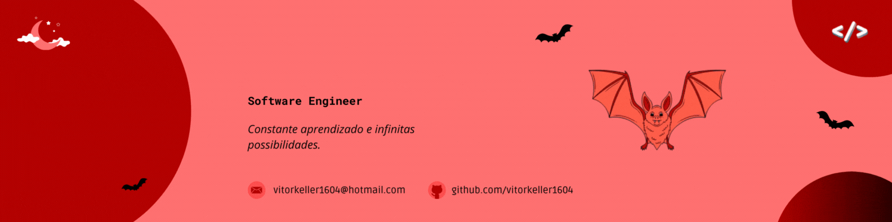

  

#

Atualmente sou estudante de Engenharia de Software no 1° Semestre na Católica SC (Centro Universitário - Católica de Santa Catarina em Joinville). Me interesso tanto por front quanto por back-end, e minhas principais linguagens são HTML e CSS. Eu estudo e me atualizo na área da tecnologia constantemente, pois adoro aprender e utilizar meus conhecimentos para criar soluções inovadoras!

#

<h3 align="left">Entre em contato!</h3>

<h3 align="left">Minha Stack ~</h3>

  
  
  
  
  
  
  
  

#

  <h3>* GitHub Stats *</h3>
   
  

  

#

<picture align="center">
  <source media="(prefers-color-scheme: dark)" srcset="https://raw.githubusercontent.com/vitorkeller1604/vitorkeller1604/output/github-contribution-grid-snake-dark.svg">
  <source media="(prefers-color-scheme: light)" srcset="https://raw.githubusercontent.com/vitorkeller1604/vitorkeller1604/output/github-contribution-grid-snake-dark.svg">
  
</picture>
